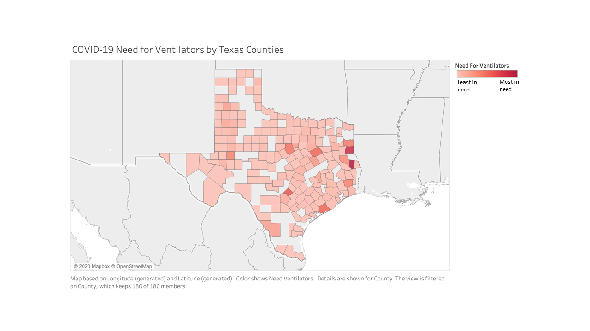

# Distributing Ventilators Across Texas Counties
The United States is currently suffering from a vast shortage of ventilators in the midst of the COVID-19 pandemic. These ventilators are very important for saving lives which has caused politicians and health officials to desperately attempt to acquire more ventilators for their civilians. Governors have been able to successfully acquire more ventilators for their states, but there are a lot of questions about how they should best distribute these ventilators. Should the counties containing large cities get priority to newly acquired ventilators? What about counties without many medical resources to begin with?

We aim to help answer these difficult questions with our work. **Please check out our presentation here:** https://docs.google.com/presentation/d/1JE3THHwUqQjWRhMBIVQrZ5xJsh6oh6ZjjqNmyrHrhgQ/edit?usp=sharing

# Contributors
Henry Creamer, Jake Joseph, Robert Walsh, and Yong Shin
